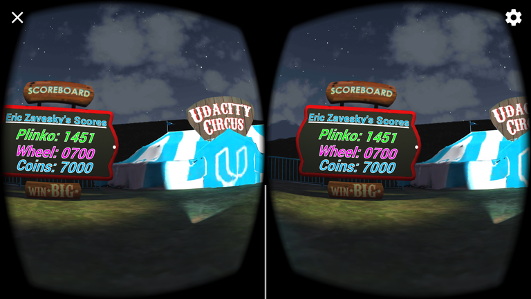

# udnd_01_carnival
udnd Carnival Customization - August 2017

Customizations included:
* Name modification
* Wheel score modification
* Coin toss modification to match requested settings
* Plinko oscillation modification
* Bear movement to avoid camera

## Project Contents
Quick description of contents within this repo.

* Assets - assets including GoogleVR SDK clips for project
* ProjectSettings - project settings for builds
*	.gitignore - ignore file based on Unity footprint
*	Build.zip - compressed build and package
*	LICENSE - current license
*	README.md - this file
*	screenshot.png - running modification from mobile device

## Requirements
Software and build environment requirements.

* [Unity 2017.1.0](https://unity3d.com/get-unity/download/archive)
* [GVR Unity SDK v1.60.0](https://github.com/googlevr/gvr-unity-sdk/releases/tag/v1.60.0)
* Course starter materials
* Android KitKat 4.4 or later
